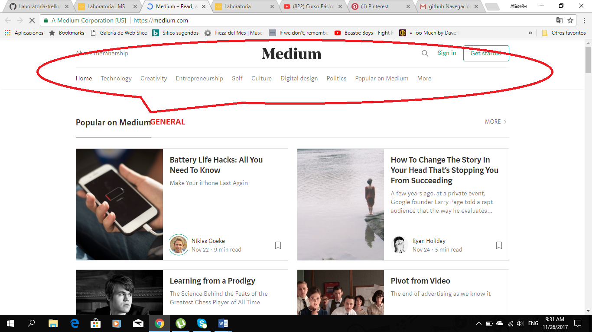

# BEATHER

NAVEGACION GLOBAL

* Nos permite  navegar por todo el contenido de la pagina.

BEATHER

NAVEGACION FACETADA

* Esta   navegación es  facetada , nos permite  acceder a  información filtrada pero  por defecto , nos permitiéndonos modificarla.

# GITHUB

* Navegación Global

Nos permite navegar por el sitio.

* Navegación Local

Nos permite navegar por secciones  de la pagina.

* Navegación Facetada

Nos brinda información filtrada  configurada pon la página, sin opción a que  la podamos delimitar en más  filtros.

# MEDIUM

* NAVEGACION GLOBAL

Es la navegación que me permite  navegar por el sitio  y  aparece persistentemente  en el  recorrido de la página.

* NAVEGACION FACETADA
La pagina  ha filtrado informacion por temas y la coloca como opcion de  navegacion para el usuario.

* NAVEGACION POR CONTEXTO
La navegación facetada  ( temática  brindada por  el sitio )que elegimos  nos hace ingresar a  un conjunto de   contenido  similar , este navegación en particular  seria contextual.  

